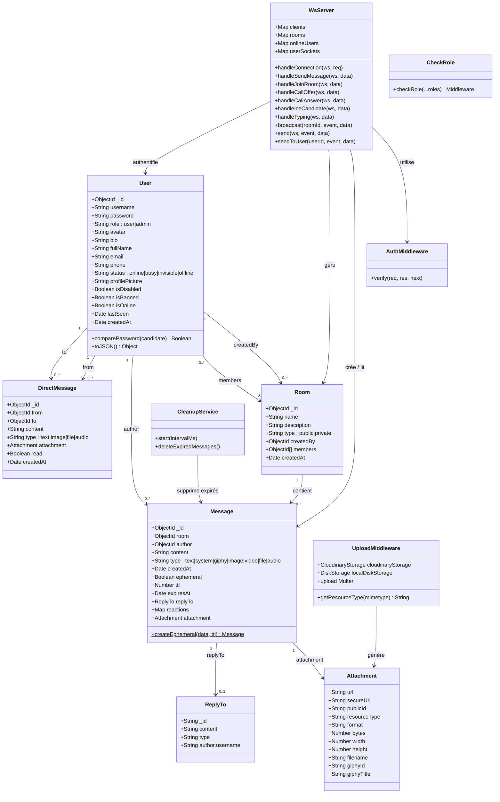
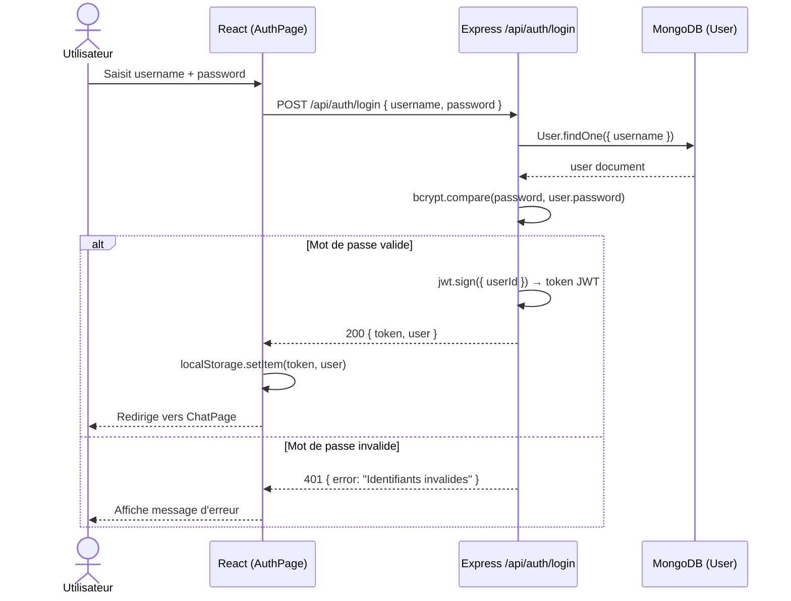
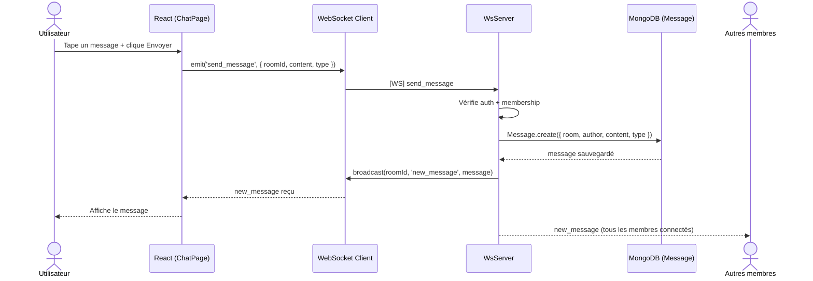
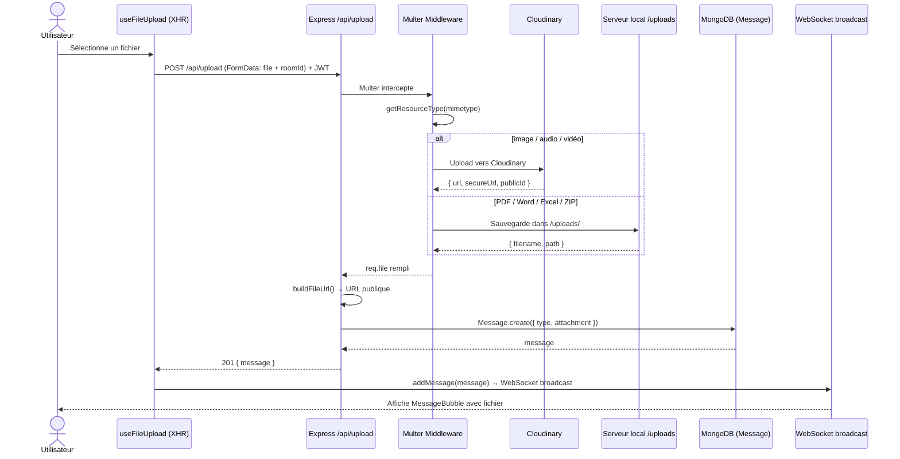
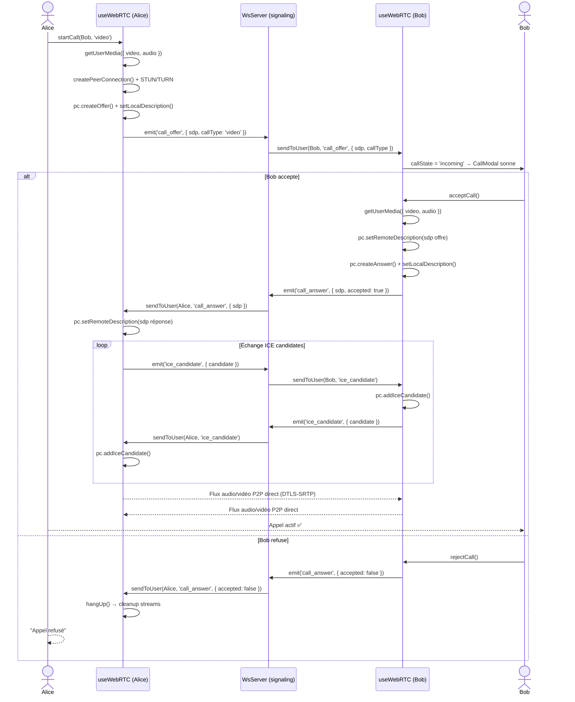
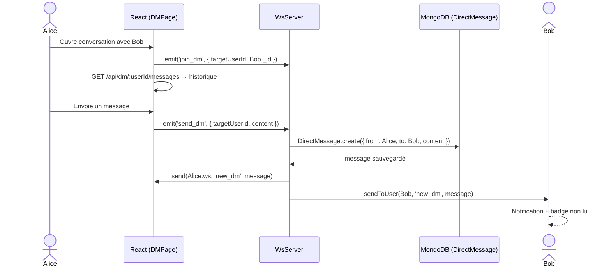

# 📐 Diagrammes UML — Arcane Chat

> Syntaxe **Mermaid** — rendu automatique sur GitHub, GitLab, Notion, ou https://mermaid.live

---

## 1. 🎯 Diagramme de Cas d'Utilisation

```mermaid
flowchart TD
    Visiteur((Visiteur))
    User((Utilisateur))
    Admin((Administrateur))

    Visiteur --> UC0[S'inscrire]
    Visiteur --> UC1[Se connecter]
    Visiteur --> UC2[Continuer en tant qu'invité]

    User --> UC3[Rejoindre un salon]
    User --> UC4[Envoyer un message texte]
    User --> UC5[Envoyer un fichier / image]
    User --> UC6[Envoyer un message vocal]
    User --> UC7[Envoyer un GIF Giphy]
    User --> UC8[Répondre à un message]
    User --> UC9[Réagir avec un emoji]
    User --> UC10[Supprimer / modifier un message]
    User --> UC11[Envoyer un message éphémère]
    User --> UC12[Créer un salon]
    User --> UC13[Voir les membres en ligne]
    User --> UC14[Envoyer un message privé DM]
    User --> UC15[Lancer un appel audio]
    User --> UC16[Lancer un appel vidéo]
    User --> UC17[Accepter / Refuser un appel]
    User --> UC18[Couper micro / caméra]
    User --> UC19[Modifier son profil]
    User --> UC20[Se déconnecter]

    Admin --> UC3
    Admin --> UC4
    Admin --> UC21[Accéder au backoffice admin]
    Admin --> UC22[Gérer les utilisateurs - ban / disable / rôle]
    Admin --> UC23[Gérer les salons - créer / supprimer]
    Admin --> UC24[Supprimer des messages]
    Admin --> UC25[Voir les statistiques]
    Admin --> UC26[Réinitialiser un mot de passe]

    UC15 -.inclut.-> UC17
    UC16 -.inclut.-> UC17
    UC5 -.inclut.-> UC5a[Upload Cloudinary / local]
    UC6 -.inclut.-> UC5a
```

---

## 2. 🗂️ Diagramme de Classes

---

## 3. 🔄 Diagrammes de Séquence

### 3a. Authentification (Login)

---

### 3b. Envoi d'un message texte

---

### 3c. Upload d'un fichier (PDF, image, audio...)

---

### 3d. Appel vidéo WebRTC (de bout en bout)

---

### 3e. Message privé DM

